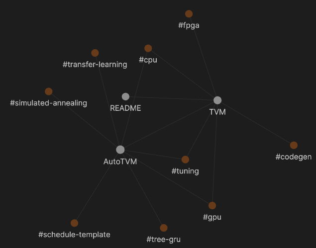

Deep Learning Compiler Literatures
==================================

This repository is inspired by [Obsidian](https://obsidian.md/), which stores each entry to a markdown (.md) file and maintains a knowledge graph between entries. For example, if an entry `A` mentions another entry `B` with the syntax `[[B]]`, then Obsidian knowledge graph will build an edge between `A` and `B`. The following figure shows an example of the knowledge graph with tags included.

I attempt to use this feature to connect deep learning compiler research papers. I will start with TVM and gradually add more papers. Everyone is welcome to contribute new entries or comment on existing entries. However, I do not plan to build a forum or a discussion panel. Instead, I hope to keep the summary and comment concise so that everyone can easily catch up the overall idea about the latest developments of deep learning compilers.

## Web Deployment

I wrote a simple script to parse all markdown files in this repo and generate a JSON file. The JSON file could be used for web deployment. By setting a Github action to run the script and deploy the generated graph to `gh-pages` branch, an interactive graph is instantly deployed to the website of this repo: https://comaniac.github.io/dlc-literature/.

Please note that I am a very bad at the frontend, so the website is basically copy-paste from https://philogb.github.io/jit/index.html. You are VERY welcome to send pull requests to improve the website by all means.

Specifically, here are the TODOs I am currently thinking:

- Embed the markdown page of the currernt focused node on the bottom.
- Hyperlink the markdown file on the node name of the right container.
- A better CSS style.

## How to Contribute
1. Create a new file named "paper-tag.md". Note that "paper-tag" would be the keyword mentioned by other entries, so it should be just one or two words. For the paper that presents a system such as TVM, the system name itself is a proper tag; otherwise, the representative algorithm, feature, methodology could also be candidates. If you really have no clue, then "LastNameOfFirstAuthor-Year.md" could also work.
2. Copy the [template](./artifacts/template.md) to the created file and fill out the contents.
3. If the paper is publicly available, please provide the PDF URL.

## Backlog Papers
- [Triton: An Intermediate Language and Compiler for Tiled Neural Network Computations](http://www.eecs.harvard.edu/~htk/publication/2019-mapl-tillet-kung-cox.pdf)
- [SWIRL: High-performance many-core CPU code generation for deep neural networks](https://journals.sagepub.com/doi/abs/10.1177/1094342019866247)
- [TASO : Optimizing Deep Learning Computation with Automatic Generation of Graph Substitutions](http://theory.stanford.edu/~aiken/publications/papers/sosp19.pdf)
- [Diesel: DSL for linear algebra and neural net computations on GPUs](https://www.researchgate.net/profile/Vinod_Grover/publication/325639900_Diesel_DSL_for_linear_algebra_and_neural_net_computations_on_GPUs/links/5cf0ba244585153c3da7b019/Diesel-DSL-for-linear-algebra-and-neural-net-computations-on-GPUs.pdf)
- [Tensor Comprehensions: Framework-Agnostic High-Performance Machine Learning Abstractions](https://arxiv.org/pdf/1802.04730.pdf)
- [Learning to Fuse](http://mlforsystems.org/assets/papers/neurips2019/learning_abdolrashidi_2019.pdf)
- [Learned TPU Cost Model for XLA Tensor Programs](http://mlforsystems.org/assets/papers/neurips2019/learned_tpu_kaufman_2019.pdf)
- [Automatic generation of high-performance quantized machine learning kernels](https://www.cs.utexas.edu/~bornholt/papers/quantized-cgo20.pdf)
- [Automatic Kernel Generation for Volta Tensor Cores](https://arxiv.org/pdf/2006.12645.pdf)
- [PolyDL: Polyhedral Optimizations for Creation of High Performance DL primitives](https://arxiv.org/pdf/2006.02230.pdf)
- [A Learned Performance Model for the Tensor Processing Unit](https://arxiv.org/pdf/2008.01040.pdf)
- [Evolutionary Algorithm with Non-parametric Surrogate Model for Tensor Program Optimization](https://ieeexplore.ieee.org/abstract/document/9185646/)
- [Transferable Graph Optimizers for ML Compilers](https://arxiv.org/pdf/2010.12438.pdf)
- [A Deep Learning Based Cost Model for Automatic Code Optimization in Tiramisu](https://www.researchgate.net/profile/Massinissa_Merouani/publication/344948008_A_Deep_Learning_Based_Cost_Model_for_Automatic_Code_Optimization_in_Tiramisu/links/5f9a79b2458515b7cfa73e8d/A-Deep-Learning-Based-Cost-Model-for-Automatic-Code-Optimization-in-Tiramisu.pdf)
- [GAMMA: Automating the HW Mapping of DNN Models on Accelerators via Genetic Algorithm](https://ieeexplore.ieee.org/abstract/document/9256431)
	- Looks relate to BYOC.
- [SODA: a New Synthesis Infrastructure for Agile Hardware Design of Machine Learning Accelerators](https://ieeexplore.ieee.org/abstract/document/9256693)
	- From David Brooks's group. Software Defined Architecture.
- [A Case for Generalizable DNN Cost Models for Mobile Devices](https://ieeexplore.ieee.org/abstract/document/9251246)
	- Relate to cost model for edge devices.
- [Rammer: Enabling Holistic Deep Learning Compiler Optimizations with rTasks](https://www.usenix.org/system/files/osdi20-ma.pdf)
	- From MS. Finer-grained fusion strategy.
- [Jittor: a novel deep learning framework with meta-operators and unified graph execution](http://scis.scichina.com/en/2020/222103.pdf)
	- JIT DLC for CPU and GPU.
- [DLFusion: An Auto-Tuning Compiler for Layer Fusion on Deep Neural Network Accelerator](https://arxiv.org/pdf/2011.05630.pdf)
	- Yet another fusion strategy.
- [Estimating GPU memory consumption of deep learning models](https://dl.acm.org/doi/abs/10.1145/3368089.3417050)
	- GPU memory cost model.
- [The Deep Learning Compiler: A Comprehensive Survey](https://arxiv.org/pdf/2002.03794.pdf)
- [Deep Learning Systems: Algorithms, Compilers, and Processors for Large-Scale Production](https://www.morganclaypool.com/doi/abs/10.2200/S01046ED1V01Y202009CAC053)
	- Book. 10/2020.
